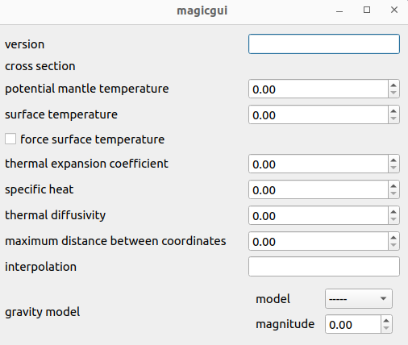

testing out a GWB schema to python model pipeline

## overview 

Two steps in this test

1. generate a static `pydantic` model of the WB schema via `datamodel-code-generator`
2. use `yt_napari`'s `pydantic` to `magicgui` framework to run a widget


## setup 

Need python >= 3.8ish? 

```commandline
pip install -r requirements.txt
```

generate the pydantic model:

```commandline
datamodel-codegen --input gwb_schema_test/world_builder_declarations.schema.json --output gwb_schema_test/wb_pydantic.py
```

run the magicgui widget test (note, not all the pydantic fields are handled properly):

```commandline
python wb_magicgui.py
```

errors:

```commandline
yt_napari : [WARNING ] 2023-11-10 11:12:57,027:  magicgui could not identify a widget for  <class 'gwb_schema_test.wb_pydantic.CrossSectionItem'>.__root__, which has type typing.Any
yt_napari : [WARNING ] 2023-11-10 11:12:57,037:  magicgui could not identify a widget for  <class 'gwb_schema_test.wb_pydantic.Model'>.coordinate_system, which has type typing.Union[gwb_schema_test.wb_pydantic.CoordinateSystemItem, gwb_schema_test.wb_pydantic.CoordinateSystemItem1, NoneType]
yt_napari : [WARNING ] 2023-11-10 11:12:57,041:  magicgui could not identify a widget for  <class 'gwb_schema_test.wb_pydantic.Model'>.features, which has type typing.Union[gwb_schema_test.wb_pydantic.Feature, gwb_schema_test.wb_pydantic.Feature1, gwb_schema_test.wb_pydantic.Feature2, gwb_schema_test.wb_pydantic.Feature3, gwb_schema_test.wb_pydantic.Feature4]
```

resulting widget: 


